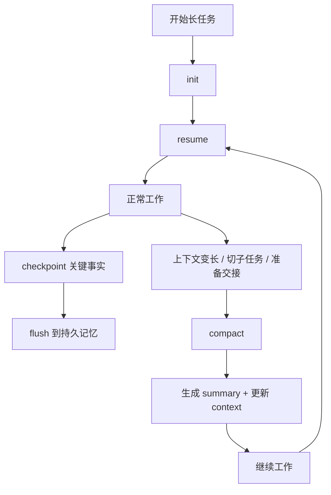

# Context Governor

面向长会话 Agent 的上下文治理中间层，用来解决 4 类典型问题：

- 压缩前，关键事实还没落盘
- 压缩后，行为规则和工作流丢失
- 最近几轮对话断片
- 摘要质量不稳定，导致长 session 越跑越偏

第一版提供：

- `memoryFlush`：接近上下文上限时，把高价值事实写入持久记忆
- `postCompactionSections`：压缩后重注入关键规则章节
- `recentTurnsPreserve`：保留最近若干轮原始对话
- `qualityGuard`：轻量摘要结构审计接口

## 它是怎么工作的

核心链路是：

1. `init`：为当前 session 建立治理目录和规则
2. `resume`：恢复当前目标、约束、待办、规则和最近上下文
3. `checkpoint`：把刚确认的重要事实写成结构化条目
4. `flush`：把这些事实持久化到记忆文件
5. `compact`：在会话变长时重建一个可继续执行的短上下文
6. 下次继续任务时再次 `resume`

可以把它理解成一条“长会话防失忆流水线”：



## 在 Codex 应用里的真实使用方式

这套现在已经接成“用户级全局工作流”，重点是：

- 不是写进某个工程仓库
- 不是要求你手动开 CLI
- 而是通过全局 `AGENTS.md` + 全局 PowerShell 脚本，让 Codex 应用里的 agent 自己去调用

全局入口在：

- 用户级规则：[C:\Users\prohibit\.codex\AGENTS.md](C:\Users\prohibit\.codex\AGENTS.md)
- 用户级脚本目录：`C:\Users\prohibit\.codex\scripts`

当前已经接好的全局脚本有：

- `context-governor-init.ps1`
- `context-governor-adopt.ps1`
- `context-governor-resume.ps1`
- `context-governor-checkpoint.ps1`
- `context-governor-flush.ps1`
- `context-governor-compact.ps1`

推荐安装方式：

1. 把本仓库放到用户级固定目录，例如 `C:\Users\<用户名>\.codex\tools\context-governor`
2. 把 `scripts/codex-global/` 下的脚本复制到 `C:\Users\<用户名>\.codex\scripts`
3. 把 `templates/codex-user/AGENTS.md` 的内容合并到用户级 `AGENTS.md`
4. 根据本机用户名和路径，检查脚本里的 `GovernorDir` 与 `MemoryDir`

这样以后你打开任何新项目，都只依赖用户级 `.codex` 配置，不依赖某个具体业务工程目录。

为了让别人能按仓库完整复现这套应用端接法，仓库里现在也包含：

- 全局脚本样例目录：`scripts/codex-global/`
- 用户级 `AGENTS.md` 模板：`templates/codex-user/AGENTS.md`

也就是说，别人拉取这个仓库后，不只能跑库本身，还能照着模板把 Codex 应用端全局工作流配置起来。

Codex 应用里的默认工作节奏是：

1. 打开任意工程，开始一个非简单任务
2. agent 先初始化当前 workspace 的 governor session
3. 如果是“继续刚才任务”，先做 `resume`
4. 用户确认了目标、约束、待办、关键文件后，agent 做 `checkpoint`
5. 阶段结束时 `flush`
6. 会话变长、切子任务、准备交接时 `compact`

如果是新开对话但要继续旧任务：

7. 先执行 `adopt`
8. 再 `resume`

`adopt` 的默认选择逻辑：

- 如果明确给了 `SourceSessionId`，就接管指定 session
- 否则如果给了 `SourceThreadId`，就接管那个线程对应的 session
- 否则自动从 `events.jsonl` 里挑当前 workspace 最近活跃的 session
- 如果事件日志里没有可用候选，再退回到 `latestSessionId`

多开会话时的隔离策略：

- 优先按 `CODEX_THREAD_ID` 隔离
- 也就是同一个 workspace 下，不同 Codex 会话线程会绑定到不同 `sessionId`
- 只有在拿不到 `CODEX_THREAD_ID` 时，才会退回到 workspace 级别的 `latestSessionId`

## 文件会存到哪里

默认不会把治理文件写进你的工程目录，也不会污染 Git 仓库。

统一存到用户目录根下，但会再按 workspace 单独分文件夹：

`C:\Users\prohibit\.codex\memories\context-governor`

结构大致如下：

```text
C:\Users\prohibit\.codex\memories\context-governor\
  workspaces\
    ai-project-4b84b15b\
      workspace.json
      events.jsonl
      workspace-sessions.json
      <sessionId>\
        config.json
        instructions.json
        context.json
        facts.jsonl
        state.json
        workspace-brief.md
        snapshots\
```

也就是说：

- 所有工程仍然挂在同一个根目录下，方便统一备份
- 但每个工程都会有自己单独的子目录，不再把不同工程的 session 平铺混在一起
- 子目录名会带工程名和短哈希，避免同名文件夹冲突

各文件作用：

- `events.jsonl`
  - 当前 workspace 自己的事件日志，记录 `init / resume / checkpoint / flush / compact` 是否触发
- `workspace-sessions.json`
  - 记录“当前 workspace 下，不同 threadId 对应哪个 sessionId”
  - 同时保留一个 `latestSessionId` 作为无 threadId 时的兜底
- `workspace.json`
  - 当前子目录对应的是哪个真实工程路径
- `facts.jsonl`
  - 原始增量记忆账本
- `state.json`
  - 当前聚合后的有效记忆视图
- `context.json`
  - 当前工作上下文快照
- `instructions.json`
  - 压缩后需要重新注入的规则
- `snapshots/`
  - compaction 前后的快照

## 真实使用场景举例

### 例子 1：在 Codex 应用里做一个长代码任务

场景：

- 你在 Codex 应用里打开某个工程
- 让它连续做一个超过 30 轮的重构任务

实际流程：

1. agent 先为当前 workspace 建一个 session
2. 当你确认目标时，agent 会把类似下面的信息 checkpoint 进去：

```text
goal: 重构上下文治理模块
constraint: 不引入新框架
todo: 先打通 flush 和 compact 主链路
artifact: src/context-manager.ts
```

3. 阶段结束时，agent 会把这些结构化事实 flush 到持久记忆
4. 当会话变长时，agent 会 compact，保留规则、summary、active memory 和最近几轮对话
5. 你下次说“继续刚才任务”，agent 先 resume，再继续工作

结果：

- 即使聊天上下文变长
- 目标、约束、待办、关键文件仍然能从全局记忆里恢复

### 例子 2：同一个工程第二天继续

场景：

- 昨天在 `D:\ai_project` 里做了一半
- 今天重新打开 Codex 应用，继续同一个工程

实际流程：

1. agent 先定位当前工程对应的 workspace 子目录
2. 再通过这个子目录里的 `workspace-sessions.json` 找 session
3. 找到对应的 `sessionId`
4. 执行 `resume`
5. 从 `state.json + context.json + instructions.json` 里恢复：
   - 当前目标
   - 已确认约束
   - 未完成事项
   - 规则和工作方式

结果：

- 不需要完全依赖聊天窗口剩余上下文
- 长任务续接更稳

### 例子 2.5：新开一个对话，但想接着上一个会话继续

场景：

- 你开了一个新的 Codex 对话线程
- 但本质上还是想继续上一个线程里做到一半的任务

实际流程：

1. 新线程默认会有新的 `CODEX_THREAD_ID`
2. 这时不能直接依赖同线程 `resume`，因为它还没绑定到旧 session
3. 应先执行 `context-governor-adopt.ps1`
4. `adopt` 会把“当前新线程”绑定到旧的 `sessionId`
5. 随后再执行 `resume`

结果：

- 新线程可以显式继承旧线程的任务状态
- 同时又不会让所有线程默认串到一起
- 如果你没有指定来源，系统会优先选择最近活跃的旧 session

### 例子 3：同一个工程里同时开两个 Codex 会话

场景：

- 你在同一个工程里同时开两个不同的 Codex 会话
- 一个会话在做“重构”
- 另一个会话在做“调试”

实际流程：

1. 两个会话各自有自己的 `CODEX_THREAD_ID`
2. `context-governor-init` 会优先用 `workspace + threadId` 建立映射
3. 后续的 `resume / checkpoint / flush / compact` 都优先按当前 threadId 查自己的 session

结果：

- 同一工程下的不同 Codex 会话，不会默认共用一份记忆
- “重构”不会覆盖“调试”的 todo 和状态
- 事件日志里也能看到每条事件属于哪个 `threadId`

### 例子 4：你想确认这套机制有没有真的生效

最直接的检查路径：

1. 先看当前工程对应的 workspace 子目录有没有生成
2. 再看这个子目录里的 `events.jsonl` 有没有 `init / resume / checkpoint / flush / compact`
3. 看这个子目录里的 `workspace-sessions.json` 是否存在
4. 看对应 session 目录有没有生成
5. 看 `facts.jsonl` 里有没有 `goal / constraint / todo / artifact`
6. 看 `state.json` 里有没有 active memory
7. 看 `context.json` 是否在 compaction 后更新

一个真实的 `resume` 输出会像这样：

```text
# Session Resume: 20260402-164249-global-app-smoke

## Rules
- output: 输出简洁，优先状态、原因、修复、下一步。
- memory: 只持久化已确认的 goal、constraint、decision、todo、artifact，不写猜测。

## Active Memory
- [goal] 让 Codex 应用全局自动使用上下文治理
- [constraint] 用户不手动使用 CLI
- [todo/active] 通过全局 AGENTS 和脚本驱动自动调用
```

一个真实的 `events.jsonl` 事件会像这样：

```json
{"timestamp":"2026-04-02T16:44:13.0000000+08:00","eventType":"checkpoint","sessionId":"20260402-164249-global-app-smoke","workspacePath":"D:\\ai_project","data":{"goalCount":1,"constraintCount":1,"decisionCount":0,"todoCount":1,"doneCount":0,"artifactCount":1,"flushAfter":true,"compactAfter":false}}
```

`adopt` 事件会像这样：

```json
{"timestamp":"2026-04-02T18:00:00.0000000+08:00","eventType":"adopt","sessionId":"20260402-172233-event-log-smoke","workspacePath":"D:\\ai_project","threadId":"<current-thread>","data":{"sourceSessionId":"20260402-172233-event-log-smoke","sourceThreadId":"<old-thread>","autoSelected":true}}
```

如果你只是想确认“agent 到底有没有自动触发这套机制”，优先看：

- `C:\Users\prohibit\.codex\memories\context-governor\workspaces\<workspace-folder>\events.jsonl`

只要这里有持续写入事件，就说明后台自动化在工作。

如果你还想确认多会话是否真的隔离，可以再看：

- `C:\Users\prohibit\.codex\memories\context-governor\workspaces\<workspace-folder>\workspace-sessions.json`

一个真实的映射会像这样：

```json
{
  "d:\\ai_project": {
    "latestSessionId": "20260402-172859-thread-h",
    "threads": {
      "thread-g": {
        "sessionId": "20260402-172859-thread-g"
      },
      "thread-h": {
        "sessionId": "20260402-172859-thread-h"
      }
    }
  }
}
```

## CLI 和脚本层

虽然你在应用里不需要自己用 CLI，但底层模块仍然提供 CLI，方便调试或二次集成。

先构建：

```bash
npm install
npm run build
```

基础命令：

```bash
node dist/src/cli.js init --session demo --memoryDir ../context-governor-memory
node dist/src/cli.js append --session demo --memoryDir ../context-governor-memory --role user --content "goal: 实现长会话治理"
node dist/src/cli.js flush --session demo --memoryDir ../context-governor-memory
node dist/src/cli.js compact --session demo --memoryDir ../context-governor-memory
node dist/src/cli.js resume --session demo --memoryDir ../context-governor-memory
```

## 最小代码接入

如果你不是走 Codex 应用，而是想把它作为模块接到自己的 Agent 编排层，可以直接使用：

```ts
import { ContextManager, FileMemoryStore } from "./src/index.js";

const memoryStore = new FileMemoryStore("./memory");

const manager = new ContextManager(
  "session-1",
  {
    maxContextTokens: 24000,
    recentTurnsPreserve: 5,
    postCompactionSections: ["workflow", "handoff"],
    memoryFlush: {
      enabled: true,
      softThresholdTokens: 4000,
      lookbackMessages: 8,
    },
    qualityGuard: {
      enabled: true,
      maxRetries: 0,
    },
  },
  {
    memoryStore,
    instructionSources: {
      workflow: "Always search before answering when repo context is missing.",
      handoff: "Summarize unresolved work before yielding to another agent.",
    },
  },
);

await manager.addMessage({
  role: "user",
  content: "goal: 实现长会话上下文治理\ntodo: 写入文件记忆",
});
```

## 当前约束

- token 估算使用近似算法，不绑定具体模型 tokenizer
- 记忆抽取优先依赖结构化前缀，如 `goal:`、`todo:`、`constraint:`
- `qualityGuard` 目前只做结构完整性校验，不做重生成闭环
- CLI / 脚本模式下，当前工作上下文会写入 `context.json`，用于跨命令续接
- 现在的“应用端自动调用”本质上是全局工作流自动化，不是直接改写 Codex 内核压缩器
- 多会话隔离依赖 `CODEX_THREAD_ID`；拿不到该值时，会退回到 workspace 级别的 `latestSessionId`

## 配合 Codex 使用

如果你想看当前这套全局接法本身的文件位置：

- 全局规则：[C:\Users\prohibit\.codex\AGENTS.md](C:\Users\prohibit\.codex\AGENTS.md)
- 全局脚本目录：`C:\Users\prohibit\.codex\scripts`
- 全局记忆目录：`C:\Users\prohibit\.codex\memories\context-governor`
- 新线程接管旧任务时用：
  - `C:\Users\prohibit\.codex\scripts\context-governor-adopt.ps1`

如果你想看项目侧包装：

- 启动脚本：[start-codex-session.ps1](D:\ai_project\scripts\start-codex-session.ps1)
- 项目级规则示例：[AGENTS.md](D:\ai_project\AGENTS.md)

如果你想把这套能力发布给别人，建议按这个顺序：

1. 把仓库放到自己的 `C:\Users\<用户名>\.codex\tools\context-governor`
2. 复制 `scripts/codex-global/` 下的脚本到自己的 `C:\Users\<用户名>\.codex\scripts`
3. 参考 `templates/codex-user/AGENTS.md` 更新自己的用户级 `AGENTS.md`
4. 再根据本机路径修改脚本里的 `GovernorDir` 和 `MemoryDir`
